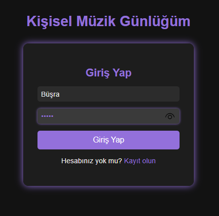
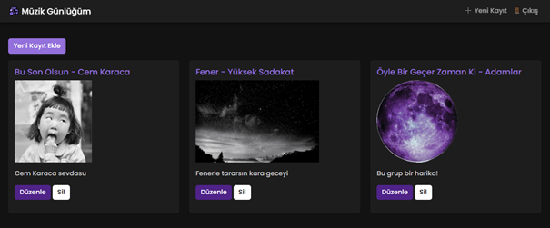
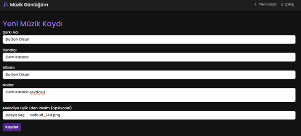

# 🎵 Müzik Günlüğüm

**Web Tabanlı Müzik Kayıt Uygulaması – PHP & MySQL**
*Web Tabanlı Programlama Dersi Projesi*

---

## 📌 Proje Tanımı

**Müzik Günlüğüm**, kullanıcıların kendi müzik notlarını dijital ortamda tutabilmelerine olanak tanıyan basit ama işlevsel bir web uygulamasıdır. Kullanıcılar kayıt olabilir, giriş yapabilir ve dinledikleri şarkılara dair bilgileri ekleyip düzenleyebilir, silebilir ve listeleyebilirler.
Proje tamamen **PHP (frameworksüz)** ve **MySQL** ile geliştirilmiştir.

---
## 🔗 Canlı Demo

[Müzik günlüğünü deneyimlemek için tıklayınız.](http://95.130.171.20/~st23360859076)

---

## 🎥 Tanıtım Videosu

[Tanıtım videosunu izlemek için tıklayınız.](https://youtu.be/w0t9gJrddkE?si=c_j1LeMblF2hhRMv)

---

## ⚙️ Kullanılan Teknolojiler

* **Backend:** PHP (Pure)
* **Veritabanı:** MySQL
* **Frontend:** HTML, CSS, Bootstrap 5
* **Yardımcı Teknolojiler:** JavaScript (temel seviye)

---

## 🚀 Temel Özellikler

* 🔐 **Kullanıcı Yönetimi**

  * Kayıt ve giriş sistemi
  * Şifrelerin güvenli şekilde hashlenmesi
  * Oturum yönetimi (PHP Session)

* 📄 **Şarkı Günlüğü CRUD İşlemleri**

  * Yeni şarkı kaydı ekleme
  * Kayıt listeleme
  * Kayıt güncelleme
  * Kayıt silme

* 🔒 **Veri Gizliliği**

  * Her kullanıcı yalnızca kendi kayıtlarını görebilir

* 💻 **Responsive Tasarım**

  * Modern ve mobil uyumlu kullanıcı arayüzü (Bootstrap 5 ile)

---

## 🖼️ Ekran Görüntüleri

### 🔐 Giriş Ekranı
  
Kullanıcı adı ve şifre ile giriş yapılan ekran.

---

### 📝 Kayıt Ekleme
  
Yeni bir müzik kaydı eklemek için kullanılan form ekranı.

---

### ✏️ Kayıt Düzenleme
  
Mevcut bir kaydın bilgilerini düzenleme sayfası.

---

## 🛠️ Kurulum ve Kullanım

1. Bu repoyu klonlayın veya ZIP olarak indirin:

   ```bash
   git clone https://github.com/kullaniciadi/muzik-gunlugum.git
   ```
2. `config/db.php` dosyasını kendi veritabanı ayarlarınıza göre düzenleyin.
3. `database.sql` dosyasındaki SQL sorguları ile gerekli veritabanı tablolarını oluşturun.
4. Bir yerel sunucuda çalıştırmak için [XAMPP](https://www.apachefriends.org/index.html) veya benzeri bir araç kullanabilirsiniz.
5. Tarayıcınızda `http://localhost/muzik-gunlugum` adresine giderek uygulamayı başlatabilirsiniz.

---

## 📁 Proje Dosya Yapısı

```bash
muzik-gunlugum/
│
├── config/
│   └── db.php
│
├── includes/
│   ├── header.php
│   └── footer.php
│
├── public/
│   └── css/
│       └── style.css
│
├── uploads/         #kullanıcının yüklediği fotoğraflar tutulur
│
├── screenshots/
│   ├── login.png
│   ├── add.png
│   └── edit.png      
│
├── index.php
├── register.php
├── login.php
├── logout.php
├── dashboard.php
├── add.php
├── edit.php
├── delete.php
│
├── README.md                   # Proje tanıtım ve kurulum belgesi
```

---

## 📝 Lisans

Bu proje eğitim amaçlı geliştirilmiş olup açık kaynak olarak paylaşılabilir.
